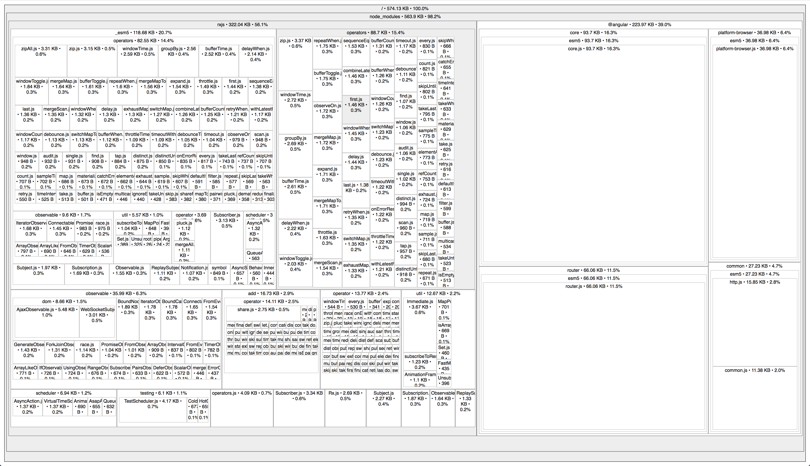
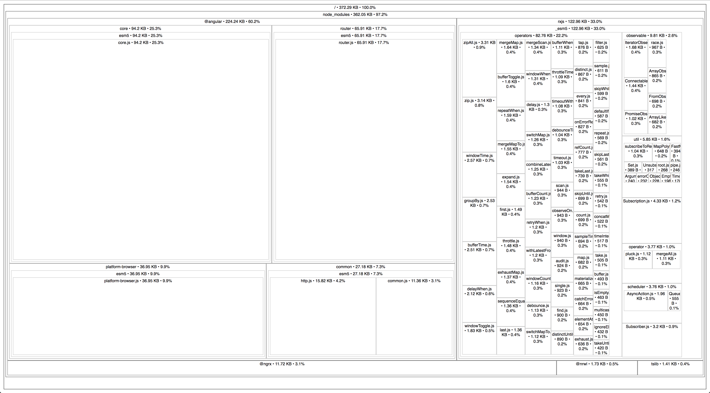

# Lab: Source Map Explorer

## Time: 5 minutes

## Scenario
We're going to analyze our app bundles to determine if there are dependencies that are taking up more space in our production bundles than the should. To do so, we're going to use a tool called `Source Map Explorer` to analyze our bundle source maps.

## Instructions
1. If you don't already have `source-map-explorer` installed, please install it now: `npm install -g source-map-explorer`
1. Let's create a new npm script to build our customer-portal application in prod mode with source-maps. This script will pass the --sourcemaps flag to Angular CLI so that our bundles will be generated with corresponding sourcemaps. Open `package.json` and add the following script to the `scripts` object: `"customer-portal:source-maps": "ng build --prod -a=customer-portal --sourcemaps"`
1. Now let's run the script to build our app with source maps: `npm run customer-portal:source-maps`
1. Let's examine the output from the build. In your editor, open `dist/apps/customer-portal`. Find the `main.whatever.bundle.js` bundle, and confirm that there is a corresponding `.map` file next to it (and every other bundle). Since the bundles have a hash in their names, copy the full name for the main bundle for the next step.
1. With our source map in place, we can use source map explorer to analyze our bundle. We'll run the global `source-map-explorer` script and pass our main bundle as the only argument to the program: `source-map-explorer <your bundle name>.js`. Source Map Explorer should open your browser with an interactive visualization of the modules that make up your bundle. 
1. Interact with the visualization and explore to see if there are modules that might not be needed for your app. Keep in mind many of the modules are not directly used by your app, but are transitive dependencies.
1. Notice that the RxJS portion of your bundle is pretty large, probably over 300KB. And notice that all RxJS operators are imported, when it's likely that not all of them are actually being used. This is a common issue, and is usually because somewhere in the application, someone is importing from 'rxjs' instead of importing from a specific path in RxJS such as 'rxjs/operators'. Using our IDE, let's search our files to find where the bad import might be. Suggested searching for `'rxjs'` since the import statement will probably look something like: `import something from 'rxjs';`.
1. The culprit can be found in a file called `authentication-state-model.effects.ts` on this line: `import {operators} from 'rxjs';`. Instead we should import the specific operator we need, `map`, from `rxjs/operators`. Update the import statement and the invocation of `map` in that module, then re-run the build script and re-evaluate the bundle with `source-map-explorer`. Now the RxJS portion of the bundle, and the overall bundle size, should be much smaller. 

## Next Lab
Go to Optimizing Performance Lab #3: [Angular Service Worker](lab-3.md)
